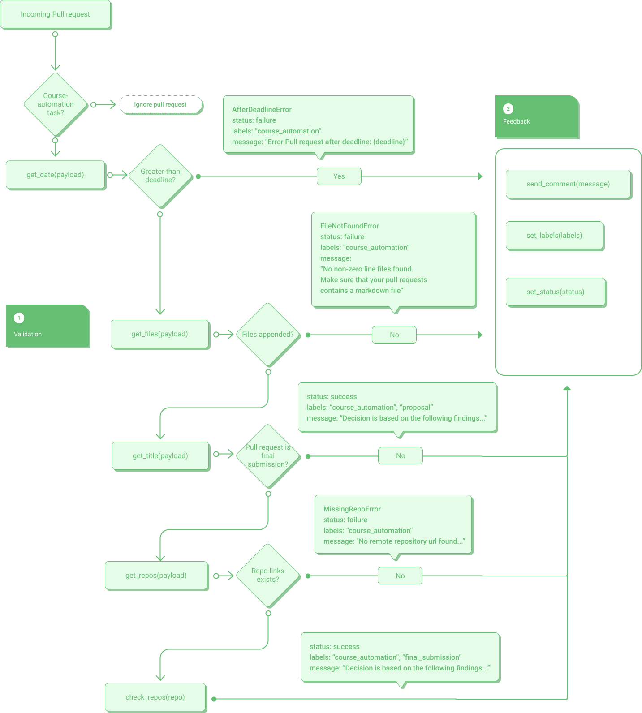

# Mandatory sanity checker for DD2482

This action is highly customized to be embedded in the KTH devops course. This implies that it probably won't have any value outside of said course.

## Changelog

- changed title from "Meta course-automation" to "Mandatory sanity checker for DD2482"
- changed installation documentation separating the two registries (GH Marketplace & PyPi)
- Removed takeaways, as it didn't provide any valuable insight to the project
- Added a Rationale section, such that a background to the creation of this action is based on
- Changed "Validation links" to "Possible outcomes"
- Added Inputs section, explaining what data is needed to make the action work as intented
- Created a flowchart (figure) of the action and appended the illustration to the README
- Published the action to Github Marketplace
- 

## Installment & how to use

One can either directly install it from pypi with pip, or use it from GitHub Marketplace.

### PyPi
`pip install dd2482-course-automation`

```yml
...
env:
  DEADLINE: "2022-04-05T17:00:00Z"
...
steps:
    - # setup python
    - run: pip install dd2482-course-automation
    - run: "ddca --deadline='${{ env.DEADLINE }}' --event=${{ github.event_path }} --secret=${{ secrets.GITHUB_TOKEN }}"
```

### GitHub Marketplace
[here](https://github.com/marketplace/actions/dd2482-metaca)

```yml
env:
  DEADLINE: "2022-04-05T17:00:00Z"

jobs:
  steps:
    - uses: actions/checkout@v2
    - uses: landeholt/dd2482-course-automation@main
      with:
        deadline: ${{ env.DEADLINE }}
        event_path: ${{ github.event_path }}
        secret: ${{ secrets.GITHUB_TOKEN }}
```

## Inputs

- DEADLINE: A datetime string on the format YYYY-mm-ddTHH:MM:SSZ
  where 
    -  YYYY is year,
    -  mm is month (01-12), 
    -  dd is day (01-31),
    -  HH is hours
    -  MM is minutes
    -  SS is seconds

## How it works



The action is built up in two steps. Validation and feedback, where validation checks for the creation and updation date that is received from the payload json-file. If the updation date is greater than the creation date, the updation date will be prioritized.

After that it checks whether the prioritized date is greater than the suggested deadline date that comes from the environment. If it is greater, an exception is thrown to the feedback handler.

After that the action further checks all the appended markdown files from the commit for the following:
  - Whether its title contains Final, Proposal or Submission.
  - Whether it contains a github repo link that isn't owned by KTH as well as being public

If it finds a markdown file that contains both of these requirements, it will go ahead and validate the pull request by appending the results to the payload dictionary.

Within the feedback section, the action will do three things. The first thing it does is to set the right label, meaning whether it is a submission or a proposal. Secondly, it sets a status to the specific workflow, such that there is a link between the pull request and its specific workflow result.

Finally sends a comment to the pull request with the right feedback that comes from the validation part of the action. Here it will explain the result as shown in Possible outcomes below.

---- Course specific content below ----

## Rationale

This is a github action that was developed for the DD2482 DevOps course @ KTH.

The course is entirely situated on github, and is built up by performing 3-5 tasks from a pool of different categories. One of these topics are `course-automation`, which is the task this repository is for.

Mandatory santity checker was created for the course, in the hopes of aiding the teaching assistants (TA) in their grading by automating the mandatory task requirements, which at the time was:

- timeliness: the automation is done before the first task deadline (in order to be useful for the course)
- repo: the code for the task is available in a public repo

These two requirements could be tedious for the TA to check for each student submission and can be easily automated.


## Possible outcomes [[link]](https://github.com/landeholt/dd2482-course-automation/pull/8)

These are the following outcomes that can occur through the workflow. See the flowchart for details.

Test the action via `pytest tests`

1. A PR is valid when: it is `final_submission`, created/updated before deadline and contains a public repository link.

> ## All mandatory parts were found. Awaiting TA for final judgement.
> Decision is based on the following findings:
> 
> created at: 2022-04-01 15:47:52+00:00
> 
> ## contributions/course-automation/johnlan/README.md
> assumed stage: `final_submission`
> 
> ```gfm
> ...
> # Assignment Submission    <-- HERE
> 
> ## Title
> 
> Automatic verification for mandatory parts of course-automation final
> ...
> ```
> 
> repos: - [dd2482-course-automation](https://www.github.com/landeholt/dd2482-course-automation)

2. A PR is valid when: it is a `proposal` and created/updated before deadline.

> ## All mandatory parts were found. Awaiting TA for final judgement.
> Decision is based on the following findings:
> 
> created at: 2022-04-01 15:50:18+00:00
> 
> ## contributions/course-automation/johnlan/README.md
> assumed stage: `proposal`
> 
> ```gfm
> ...
> # Assignment Proposal    <-- HERE
> 
> ## Title
> 
> Automatic verification for mandatory parts of course-automation final
> 
> ...
> ```
> 
> repos: - No repos found

3. A PR is invalid when:  PR is a `final_submission` and found repositories are private

> ## Error: Provided repo is not public
> Decision is based on the following findings:
> 
> created at: 2022-04-01 15:48:40+00:00
> 
> ## contributions/course-automation/johnlan/README.md
> assumed stage: `final_submission`
> 
> ```gfm
> ...
> # Assignment Submission    <-- HERE
> 
> ## Title
> 
> Automatic verification for mandatory parts of course-automation final
> ...
> ```
> 
> repos: - [dd2482-course-automation-very-secret](https://www.github.com/landeholt/dd2482-course-automation-very-secret)

4. A PR is invalid when: PR is a `final_submission` and doe not contain any repository links.

> ## Error: No remote repository url found in provided pull request. Please provide one, or clearly state in your pull request that it is only a proposal.
> Decision is based on the following findings:
> 
> created at: 2022-04-01 15:49:34+00:00
> 
> ## contributions/course-automation/johnlan/README.md
> assumed stage: `final_submission`
> 
> ```gfm
> ...
> # Assignment Submission    <-- HERE
> 
> ## Title
> 
> Automatic verification for mandatory parts of course-automation final
> ...
> ```
> 
> repos: - No repos found

5. A PR is invalid when: PR cannot be determined if it is **final submission** or **proposal**

> ## Error: Cannot find whether PR is **final submission** or **proposal**. Please state it explicitly in your PR. Preferably as the title.
> Decision is based on the following findings:
> 
> created at: 2022-04-01 15:50:56+00:00
> 
> ## contributions/course-automation/johnlan/README.md
> assumed stage: **NOT FOUND** repos: - No repos found

## Solution

We validate through parsing any provided markdown files. It has to end with `.md` due to:

https://github.com/landeholt/dd2482-course-automation/blob/14e9790f804f6a52ea44c172184c6411ead01a71/dd2482_course_automation/main.py#L140-L141

The algorithm starts of by checking whether the Pull Request was created/updated before the given deadline that can be changed in the actions `.yml` file.

https://github.com/landeholt/dd2482-course-automation/blob/14e9790f804f6a52ea44c172184c6411ead01a71/.github/workflows/check-course-automation.yml#L8-L9

After that easy condition, it starts off fetching all changed files for the Pull Request. Here it will throw an error, if the payload is empty.

When all files have been sourced, it starts of to look for a `stage`.

A stage must be one of the following:

 1. submission
 2. proposal
 3. final submission

If no stage is found, it throws an error telling the author that it cannot determine what to evaluate.

After that it continues with looking for repository links by the following regex:

```py
GITHUB_URL = re.compile(r"https:\/\/(?:www\.)?github\.com\/([^\/]+)\/([\w\d\-\_]+)")

```

that later on gets filtered further to remove repos that are owned by `KTH`.

If it could not find any public repositories for the pull request, it throws an error explaining that it could not do that.

When all checks have been processed, it begins to build the feedback.
